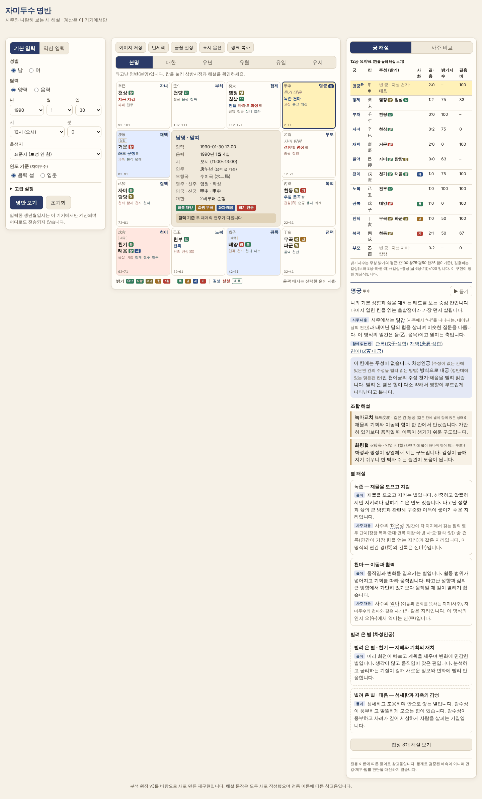
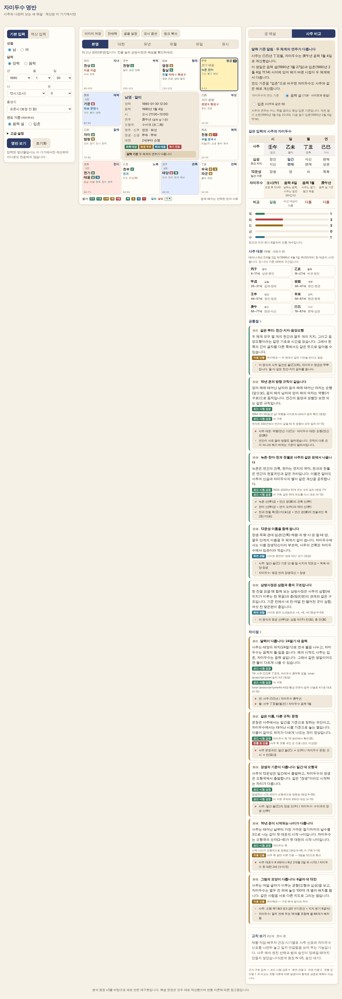
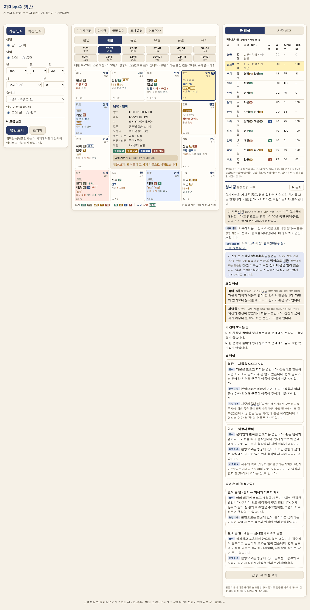
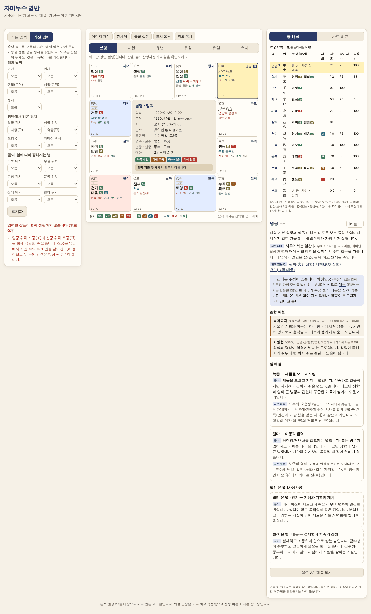
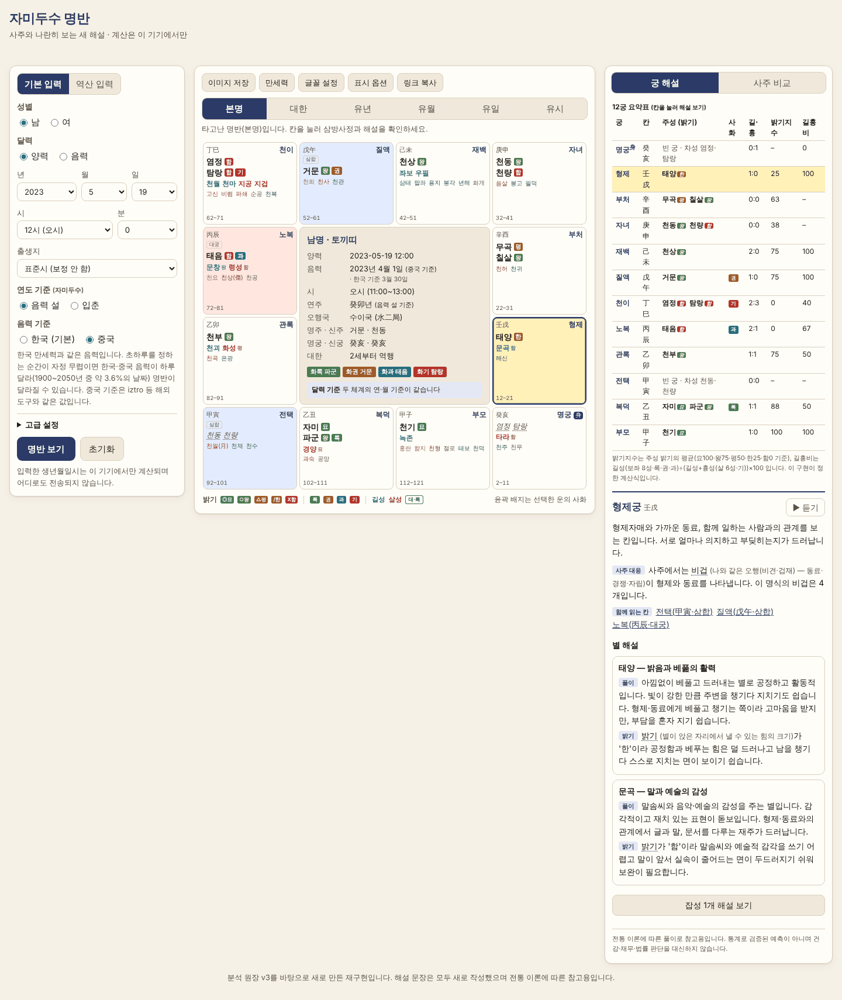

# 자미두수 명반 + 사주 비교

사주와 나란히 보는 자미두수 명반 웹사이트입니다. 「플러스자미두수 리버스 분석 원장 v3」(`docs/00-analysis-ledger-v3.*`)을 바탕으로 **다시 만들었습니다** — 기존 사이트가 맞는 곳은 재현하고, 원장이 찾은 오류(I-01~I-14)는 고치고, 빠진 기능(사주 비교)을 채웠습니다. 해설 문장·화면·로고는 모두 새로 작성했고 원본의 글·이미지·CSS 는 복사하지 않았습니다.

**계산은 모두 브라우저 안에서 이루어지고, 입력한 생년월일시는 어디로도 전송되지 않습니다.** (E2E 로 외부·비-GET 요청이 0 임을 확인합니다.)



> **이 문서의 상태** — 단계: 분석 → 설계 → 개발 → 검증 → 피드백 완료. 결과는 `docs/` 에 있습니다(아래 “문서”). **결정이 필요한 항목이 있습니다** — 가장 중요한 것은 음력 기본 기준(한국/중국)입니다([피드백](docs/05-feedback.md)).

## 빠른 시작

Node.js **22.12 이상**이 필요합니다(`.nvmrc` = 22).

```bash
npm ci            # 설치 + 의존성 패치 자동 적용(postinstall). --ignore-scripts 를 쓰지 마세요
npm run dev       # 개발 서버
npm run build     # 정적 빌드 → dist/
npm run preview   # 빌드 결과 미리보기
```

`dist/index.html` 은 서버 없이 **파일을 더블클릭해서 열어도** 동작하고, 하위 경로(`/Zamidusu/` 등)에 올려도 동작합니다(한 개의 스크립트로 묶어 `file://` 의 모듈 제한을 피합니다).

| 명령 | 하는 일 |
|---|---|
| `npm run typecheck` | `tsc --noEmit` (strict) |
| `npm test` | 단위·시나리오 테스트 200건 (약 1분) |
| `npm run build && npm run e2e` | 실제 Chromium 으로 브라우저 E2E 178건 (약 1분). `CHROME_PATH` 로 브라우저 지정 가능 |
| `npm run test:inventory` | `docs/generated/test-inventory.md` 다시 만들기 |
| `npm run e2e:report` | `docs/generated/e2e-results.md` 다시 만들기 |
| `npm run gen:lunar-kr` | 한국 음력 표(`src/core/lunarkr-data.ts`) 다시 만들기 |
| `npm run gen:notices` | `THIRD_PARTY_NOTICES.md` 다시 만들기 |

## 기능

- **명반**: 4×4 격자의 12궁에 14주성·길성·살성·잡성·12신·사화·대한 구간·밝기를 표시. 칸을 누르면 **삼방사정**(+4·+8 삼합, +6 대궁)이 강조됩니다. 빈 궁은 대궁 주성을 빌려 읽는 차성안궁을 안내합니다.
- **운 모드 6종**: 본명 · 대한 · 유년 · 유월 · 유일 · 유시. 운을 바꾸면 궁 이름·운 사화·해설이 그에 맞게 바뀝니다.
- **입력**: 양력/음력(윤달), 시·분, 성별, 출생지(국내 162곳 + 해외 25곳 + 경도 직접 입력)에 따른 **진태양시 보정**(경도 + 균시차, 시간대 이력·서머타임·1954~61년 UTC+8:30 반영). 범위는 1900~2100년. 오류는 모아서 한 번에 안내합니다.
- **연도 기준**: 음력 설(기본) / 입춘. 입춘은 날짜가 아니라 **출생 순간**으로 판정합니다.
- **음력 기준**: 한국(기본, 한국천문연구원 방식) / 중국(중국 표준시, iztro 계열 도구와 같음). 같은 생일시가 기준에 따라 **다른 명반**이 되는 날이 1900~2050년 중 3.59% 입니다(예: 2023-05-19 12시). 화면에 알림을 띄웁니다.
- **역산 입력**: 출생 정보를 모를 때, 명반에서 읽은 값(명궁·신궁 위치, 오행국, 자미성·좌보·우필·문창·문곡·삼태·팔좌 위치)과 아는 해·날짜 정보만 골라 가능한 생월·생일·생시 후보를 찾고, 후보와 연도를 골라 바로 명반을 만듭니다. 값이 서로 모순되면 어떤 값들이 충돌하는지 설명합니다.
- **시 모름**: 12시진 명반 비교표를 보여 줍니다.
- **사주 비교**: 같은 입력의 4기둥(십성·지장간·12운성·대운)을 병기하고, 사주와 자미두수의 **공통점 5 · 차이점 5** 를 근거(코드·시험 검증 / 화면 관찰 / 자료 인용 / 전통 표 인용)와 이 명식의 실측값으로 보여 줍니다. 두 체계의 연도·월 경계가 다르면 알려 줍니다. *(교차 보기 2단계는 승인 대기 — 자리표시만 있음)*
- **해설**: 별 66개 × 궁 12 × 밝기·사화·운 모드에 반응하는 새 문안. 어려운 용어는 눌러서 풀이.
- **부가**: 이미지(PNG) 저장 · 만세력 · 글꼴 설정(크기·서체) · 표시 옵션(밝기 5/7단계, 별 이름 한글·한자 등) · 링크 복사 · 해설 듣기 · 다크 모드 · 모바일 3탭 배치.

| 화면 | |
|---|---|
| 사주 비교 |  |
| 운 모드(대한) |  |
| 역산 입력(모순 설명) |  |
| 음력 기준 차이 알림 |  |

그 밖의 화면: [시 모름](docs/screenshots/04-hour-unknown.png) · [이미지 저장 결과](docs/screenshots/06-exported-image.png) · [모바일 명반](docs/screenshots/07-mobile-chart.png) · [모바일 해설](docs/screenshots/08-mobile-explain.png) · [다크 모드](docs/screenshots/10-dark-mode.png) · [태블릿 폭](docs/screenshots/11-tablet-1024.png)

## 사용 팁

- **링크 공유**: “링크 복사”는 입력값을 주소의 해시(`#y=1990&m=1&d=30…`)에 담습니다. 해시는 브라우저가 서버로 보내지 않으므로 생년월일시가 서버 접근 기록에 남지 않습니다. 예전의 `?y=…` 형식 링크는 읽기만 합니다.
- **음력 기준을 중국으로**: 입력부의 “음력 기준”에서 고르거나 링크에 `lb=cn` 을 붙입니다.
- **원본 호환 모드**(`?compat=1`): 원본 사이트의 알려진 오류(I-01~I-08)를 일부러 재현하는 **검증 전용** 스위치입니다. 화면에 경고 띠가 뜨고, 링크로만 켜집니다. 평소에는 쓰지 마세요.
- **연도 기준이 헷갈릴 때**: 입춘 직전·직후에 태어났다면 “연도 기준”을 바꿔 보고 사주 탭의 달력 기준 알림을 확인하세요.

## 구조

```
src/core/      계산(DOM 의존 없음): time(시각 정규화) chart(포국·운 모드) saju(4기둥) compare(사주 비교)
               reverse(역산) lunarkr(한국 음력) independent(검증용 독립 구현) explain/(해설 문안) …
src/ui/        React 화면과 상태(App, InputPanel, ChartBoard, ExplainPanel, SajuPanel …)
tests/         vitest 200건 / e2e/  Playwright-core 178건
scripts/       의존성 패치 적용, 한국 음력 표 생성, 고지문·목록 생성
patches/       lunar-lite 수정본과 manifest(해시) — patches/README.md
docs/          원장 · 설계 · 검증 보고서 · 품질확인서 · 피드백 · 자동 생성 증거 · 스크린샷
```

명반 엔진은 `iztro`, 사주는 `lunar-javascript` 입니다. UI 는 계산하지 않고 `src/core` 의 결과만 그립니다.

### 의존성 패치 (알아 두세요)

두 가지 때문에 `lunar-lite@0.2.8` 의 파일 5개를 설치 직후 덮어씁니다 — ① 입춘 기준 연주가 **날짜 단위**라 입춘 당일 절입 전 출생을 새해로 계산, ② 음력이 **중국 표준시(UTC+8)** 날짜로 계산되어 한국 음력과 다른 날(I-15). 덮어쓰기는 파일 해시가 원본과 정확히 같을 때만 하고, 하나라도 다르면 **아무것도 쓰지 않고 설치를 멈춥니다**. 자세한 내용은 [patches/README.md](patches/README.md).

## 검증과 품질

“코드가 돈다”가 아니라 **요구사항이 맞는지**를 봤습니다. 엔진 결과를 엔진 자신과 비교하지 않고 전통 구결에서 다시 쓴 독립 구현, 한국천문연구원 자료 기반 외부 라이브러리, 천문 공식과 대조했습니다.

| 수단 | 규모 | 결과 |
|---|---|---|
| 단위·시나리오 | 200건 | 통과 |
| 브라우저 E2E | 178건 / 18흐름 | 통과, 콘솔 오류 0, 외부 요청 0 |
| 포국 대 독립 구현 | 약 1,900건 | 불일치 0 |
| 한국 음력 대 한국천문연구원 자료 기반 | 55,121일 | 불일치 0 |
| 접근성(axe-core) | 29개 화면 상태 | 위반 0 |
| `npm audit` | 개발 의존성 포함 | 취약점 0 |

검증 중 설계에 없던 결함 10건을 찾아 고쳤습니다([검증 보고서](docs/03-verification-report.md) §5). 판정: **적합(조건부 포함)** — 요구사항 44개 중 적합 36 · 조건부 적합 7 · 미구현 1(N-05, 원장이 승인 대기로 둔 범위). 이 판정은 개발자의 **자기 검증**이며 독립 검토가 아닙니다.

**한계**: 원본 사이트를 직접 볼 수 없어 **사이트와의 일치는 확인하지 못했습니다**(대조 방법은 [피드백](docs/05-feedback.md) §2). 해설은 전통 이론에 따른 참고용이고 통계로 검증된 예측이 아니며, 명리 전문가의 감수를 받지 않았습니다. 한국 음력 2051~2100년은 같은 규칙의 계산값입니다. Firefox·Safari·실기기·스크린 리더는 확인하지 않았습니다.

## 문서

| 문서 | 내용 |
|---|---|
| [00 분석 원장 v3](docs/00-analysis-ledger-v3.md) | 입력(원본 그대로) — 사이트 역분석 결과, F·R·I·U·N·D 요구 |
| [01 설계서](docs/01-design.md) | 요구사항 추적표, 구조, 도메인 규칙, 화면, 검증 계획 + **부록 A 구현 중 변경 사항** |
| [03 검증 보고서](docs/03-verification-report.md) | 검증 수단·결과·발견한 결함 10건·변이 검사 |
| [04 품질확인서](docs/04-quality-certificate.md) | 요구사항별 판정과 조건 |
| [05 피드백](docs/05-feedback.md) | 정해 주세요 · 사이트와 대조 방법 · 다음 단계 · 위험 · 원장 v4 제안 |
| `docs/generated/` | 자동 생성 증거: 테스트 목록, E2E 결과, 시나리오 결과표 |

## 라이선스와 고지

- 이 저장소의 **라이선스는 아직 정하지 않았습니다**(저장소 소유자가 정할 일입니다). 정하기 전에는 모든 권리가 보유된 것으로 취급됩니다.
- 배포물에 포함되는 오픈소스 11개는 모두 MIT 이며 고지문과 라이선스 전문은 [THIRD_PARTY_NOTICES.md](THIRD_PARTY_NOTICES.md) 에 있습니다. `lunar-lite` 수정본의 원 저작권 고지는 `patches/lunar-lite/LICENSE` 입니다.
- 개발 전용 의존성 `korean-lunar-calendar`(한국 음력 대조용 검증 기준)는 배포물에 들어가지 않습니다.
- 모든 예시 입력은 임의 값이며 실존 인물이 아닙니다.
